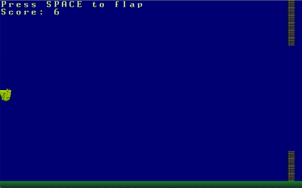

# Flappy Rust

It's a simple [flappy bird](https://flappybird.io/) clone made with [Hands On Rust](https://github.com/thebracket/HandsOnRust)

### Resources
- [bracket-lib](https://github.com/amethyst/bracket-lib)
- [flappy-dragon-sprite-sheets](https://opengameart.org/content/flappy-dragon-sprite-sheets)
